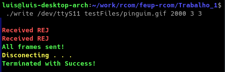
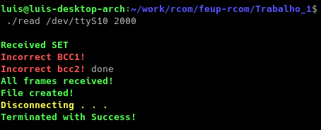
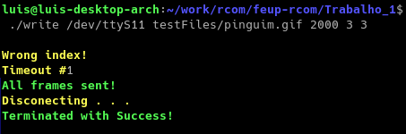
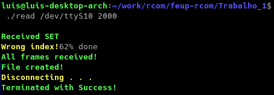

# RCOM Projeto 1
Autores:  
Filipe Reis Almeida (up201708999)  
Luís Ricardo Matos Mendes (up201604835)

## Sumário

Este trabalho aborda a comunicação entre dois computadores via porta série. A realização deste projeto consiste no desenvolvimento de um programa cujo ambiente de execução é um terminal em Linux.  
Com este relatório foi possível analisar a eficiência do nosso protocolo, concluiu-se que há um número ótimo para o tamanho do pacote na transferência que torna a aplicação mais rápida.


## Introdução

 O objetivo deste trabalho consiste em produzir uma aplicação cuja funcionalidade é executar a transferência de ficheiros entre um cliente e um servidor, conectados pela porta série. Esta aplicação tem de suportar interrupções de rede, corrupção de pacotes e a disconexão súbita do recetor.  
 
 Neste relatório está explicado a nossa implementação em termos de arquitetura e de protocolo, assim como testes de eficiência no tratamento de erros, de disconexão e de dessincronização.
 

## Arquitetura 

O código está organizado em 5 diretórios diferentes. Os diretórios 'src' e 'include' contém os ficheiros de código fonte e os ficheiros de cabeçalho, respetivamente.
No diretório 'obj' encontram-se os objetos resultantes da compilação. O diretório 'testFiles' contém os ficheiros utilizados para testar o protocolo e o 'copiedFiles' onde os ficheiros são recebidos depois do envio. O Makefile e os executáveis encontram-se na raíz da pasta.  

O nosso projeto é dividido em duas partes essenciais, a camada de aplicação (appLayer.c) e a camada de ligação (linkLayer.c). No ficheiro auxiliar.c estão contidas métodos auxiliares comuns entre a camada de ligação e a camada de aplicação. No ficheiro frame.c e o seu cabeçalho estão contidas as tramas de supervisão em forma de macros e outros métodos relacionados com o processamento de tramas. No ficheiro macros.h estão a maioria das  macros utilizadas neste projeto como o baudrate, macros que distinguem o recetor do transmissor e os bytes das tramas (bytes de controlo, flags, etc).


## Estrutura do código

A camada de ligação contém as seguintes funções principais: llopen, llread, llwrite.

Também foram criadas as funções llopenReceiver, llopenTransmitter, llcloseTransmitter e llcloseReceiver. Estas executam o protocolo como descrito com as respetivas diferenças caso seja o cliente ou o servidor.  

A camada de aplicação contém as seguintes funções principais: appLayerWrite, appLayerRead.  

No ficheiro macros.h está defenido o Baudrate, as macros usadas para distinguir o modo do programa (transmissor ou recetor), as diversas constantes utilizadas nas tramas de supervisão para o campo de endereço, campo de controlo (SET, DISC, UA, RR, REJ) e os respetivos índices.  


## Casos de uso principais

O programa é chamado da seguinte forma:
- Caso seja read: ```./read <port> <packetSize>```
- Caso seja write: ```./write <port> <fileName> <packetSize> <timeoutSeconds> <maxTries>```

Exemplos de execução do programa:
- ```./read /dev/ttyS0 2000```
- ```./write /dev/ttyS0 testFiles/pinguim.gif 2000 3 3```

O baudrate é defenido no ficheiro macros.h localizado na pasta include.

### Sequência de chamada de funções:  

```./read /dev/ttyS0 2000```  
llopen -> llopenReceiver -> appLayerRead -> llread -> unBuildFrame -> appLayerRead (segue o mesmo ciclo até receber todos os pacotes) -> llcloseReceiver.  

```./write /dev/ttyS0 testFiles/pinguim.gif 2000 3 3```  
llopen -> llopenTransmitter -> appLayerWrite -> llwrite -> buildFrame -> appLayerWrite (segue o mesmo ciclo até enviar todos os pacotes) -> llcloseTransmitter.


## Protocolo de ligação lógica

### llopen
O protocolo de ligação inicia-se no main com a execução do llopen que gera um file descriptor com a porta introduzida e establece os atributos selecionados à porta série. Existe um  método dedicado apenas a este processo, o portAttributesHandler. No nosso projeto, defenimos o VMIN e o VTIME ambos a 0. De seguida instala-se a rotina que atende as interrupções via SIGALRM. O llopen recebe como argumento o modo do programa, seja este o transmissor ou o recetor. Caso seja o transmissor, segue para o llopenTransmitter, que executa o protocolo como descrito no guião da parte do transmissor. O mesmo se aplica para caso seja o recetor, executando o llopenReceiver.  

```c
int llopen(char* porta, int mode)
{
    int fd = open(porta, O_RDWR | O_NOCTTY);

    if (fd < 0) {
        printf("Error opening port! %s", porta);
        return -1;
    }

    // Set port attributes
    portAttributesHandler(fd);

    // Instala rotina que atende interrupcao
    (void) signal(SIGALRM, atende);

    if (mode == RECEIVER) {
        if (llopenReceiver(fd) == -1) 
            return -1;
    }
    else if (mode == TRANSMITTER) {
        if (llopenTransmitter(fd) == -1)
            return -1;
    }

    alarm(0);

    return fd;
}
```

### llread

O llread aguarda o retorno da receiveFrame em loop, o método responsável pela receção da trama. Establecemos o buffer de receção de bytes como o maior possível de acordo com o tamanho da trama introduzido na chamada do programa que é o tamanho da trama multiplicado por 2, no caso improvável de todo o pacote ser composto por bytes de flag. Deste modo excluímos o uso de malloc e realloc, aumentando a rapidez de execução do programa. Após a receção da trama, retira-se as flags de início e fim de trama, faz-se o destuffing da trama, que simultaneamente calcula e retorna o bcc2. De seguida, verifica se o índice da trama recebida é o correto. No caso do recetor (llread), o índice começa com o valor 1 e alterna sempre no fim da execução do llread.
```c
   static int index = 1; // o recetor comeca com index 1
   (...)
   index ^= 1;
```
Caso a trama recebida não contenha o índice oposto do recetor na altura da receção, significa que a trama recebida está dessincronizada e envia-se a trama de rejeição.
```c
   if (receivedIndex == index) {
      printWarning("Wrong index!\n");
      if (receivedIndex == 0) 
         write(fd, FRAME_RR1, FRAME_SUPERVISION_SIZE);
      else
         write(fd, FRAME_RR0, FRAME_SUPERVISION_SIZE);
      continue;
   }
```

De seguida, faz-se a desconstrução da trama no método unBuildFrame, que recebe a trama , o tamanho e o bcc2 calculado anteriormente. Este método é responsável pela verificação dos bcc's
```c
   u_int8_t bcc1 = frame[2];

   char correctBcc1 = frame[0] ^ frame[1];

   if (correctBcc1 != bcc1) {
      printError("Incorrect BCC1! \n");
      return -1;
   }
    
   char correctBcc2 = frame[frameLength - 1];
    
   if (correctBcc2 != bcc2) {
      printError("Incorrect bcc2! \n");
      return -1;
   }    
```
Caso seja detetado um erro, envia-se a respetiva trama de rejeição e retoma-se o início do loop. Caso não haja erro, fecha-se o loop de receção, altera-se o íncide do recetor e retorna o receivedFrameSize.
```c
   if (unBuildFrame(frame, receivedFrameSize, buffer, bcc2) == -1)
      error = 1;
```
```c
   if (error) {
      error = 0;
      if (index == 0) 
         write(fd, FRAME_REJ0, FRAME_SUPERVISION_SIZE);
      else
         write(fd, FRAME_REJ1, FRAME_SUPERVISION_SIZE);
   }
   else {
      if (index == 0) 
         write(fd, FRAME_RR0, FRAME_SUPERVISION_SIZE);
      else
         write(fd, FRAME_RR1, FRAME_SUPERVISION_SIZE);
      close = 1;
   }   
```
### llwrite
O llwrite é responsável por enviar a trama e responder ao recetor de acordo com a mensagem de erro que recebe. No início é chamada o método buildFrame que recebe o pacote que lhe é passado como argumento na appLayer, o tamanho desse pacote, o index atual do recetor e um buffer onde é colocada a trama construida. O index é calculado da mesma forma que o llread.
```c
   if(!buildFrame(buffer, &length, sentFrameIndex, frame)) {
      printError("Failed to build frame! \n");
      exit(-1);
   }   
```
Logo de seguida, é enviada essa trama para a porta série. Como o método buildFrame não insere as Flags iniciais e finais da trama, o método writeFrameWithFlags escreve para a porta série sequência FLAG -> trama -> FLAG.
```c
   char flag = FRAME_FLAG;
   int writtenSize = write(fd, &flag, 1);
   writtenSize += write(fd, frame, frameLength);
   writtenSize += write(fd, &flag, 1);
```
Caso receba REJ, reenvia a mesma trama, caso receba RR, retorna o número de bytes escritos. Caso não receba resposta, o alarme establecido antes da leitura da resposta mostra uma mensagem a cada timeoutSeconds, durante maxTries. Ambos estes argumentos são recebidos como argumentos de chamada do programa, introduzidos pelo utilizador.

### llcloseTransmitter e llcloseReceiver
Em vez do llclose sugerido, foram criados estes dois métodos que executam as partes diferentes do protocolo caso seja transmissor ou recetor.

No llcloseTransmitter, o transmissor envia a trama de supervisão DISC, aguarda por um DISC de resposta e após a receção deste, envia uma trama UA para o recetor e fecha a porta série.
```c
   // Send DISC
   printWarning("Disconecting . . .\n");
   write(fd, FRAME_DISC, FRAME_SUPERVISION_SIZE);

   // Receive DISC
   char bufferAux[FRAME_SUPERVISION_SIZE];
   receiveFrame(fd, bufferAux);

   if (checkIfIsFrame(bufferAux, FRAME_DISC, 0)) {
      write(fd, FRAME_UA, FRAME_SUPERVISION_SIZE);
      close(fd);
      printSuccess("Terminated with Success!\n\n");

      return 0;
   }
```

No llcloseReceiver, o recetor aguarda pela receção de uma trama de supervisão DISC, envia um DISC de resposta e aguarda a receção da trama UA. Após a receção desta, fecha a porta série e termina a execução.
```c
   printWarning("Disconnecting . . .\n");

   int close = 0;
   while(!close) {
      // Receive DISC
      char bufferAux[FRAME_SUPERVISION_SIZE];
      receiveFrame(fd, bufferAux);

      if (checkIfIsFrame(bufferAux, FRAME_DISC, 0)) {
         // Send DISC
         write(fd, FRAME_DISC, FRAME_SUPERVISION_SIZE);

         // Receive UA
         receiveFrame(fd, bufferAux);

         if (checkIfIsFrame(bufferAux, FRAME_UA, 0)) {
            close(fd);
            printSuccess("Terminated with Success!\n\n");
            return 0;
         }
      }
      else {
         continue;
      }
   }
```


## Protocolo de aplicação
O protocolo de aplicação está dividido em duas funções principais: appLayerWrite e appLayerRead.

A appLayerWrite começa por extrair todas as informações necessárias para processar e abrir o ficheiro. Começa por construir o pacote de controlo inicial, abrindo depois o ficheiro para começar a criar pacotes de informação. Por cada pacote, coloca os bytes de controlo num buffer e percorre o seu espaço correspondente no ficheiro, copiando toda a informação necessária até ter o tamanho requesitado. Por fim constroi e envia o pacote de controlo final.

```c
   char * initial_packet = buildControlPacket(2, &packet_size);
   if (llwrite(fd, initial_packet, packet_size) == -1)
      return -1;
```

```c
   while(packet_size > 0) {
      char * packet = buildDataPacket(filePtr_copy, fileName, packet_nr, &packet_size); 
      if (packet_size == 0)
         break;
      packet_nr++;

      if (llwrite(fd, packet, packet_size) == -1)
         return -1;
      free(packet);
   }
```

```c
   char * final_packet = buildControlPacket(3, &packet_size);
   if (llwrite(fd, final_packet, packet_size) == -1)
      return -1;
```

A appLayerRead recebe os pacotes e, dependendo do tipo, processa-os de maneiras diferentes. Quando recebe o pacote de controlo inicial, retira as informações necessárias e cria as estruturas de dados para guardar a informação. Ao receber um pacote de dados, processa os bytes de controlo e guarda a informação no espaço de memória já reservado.
Por fim, quando deteta o pacote de controlo final, cria o ficheiro com os dados que tem guardados.

```c
   while(*packet != 3) {
        // Read bytes
        if (llread(fd, packet) == -1)
            return -1;
        
        file_ptr = readPacket(packet, file_ptr);

        if (packet_nr == 0) {
            total_packets = (file_info.size / file_info.size_per_packet) + 3;
        }
        packet_nr++;
        progressBar(packet_nr, total_packets);
    }
```

```c
   char* readPacket(char* packet, char* file_ptr) {
      u_int8_t packet_type = *packet;
      if(packet_type == 0x01) {
         file_ptr = readDataPacket(packet, file_ptr);
      }
      else if(packet_type == 0x02) {
         file_ptr = readStartPacket(packet, file_ptr);
      }
      else if(packet_type == 0x03) {
         file_ptr = readEndPacket(packet, file_ptr);
      }
      return file_ptr;
   }
```
<br>

## Validação

Para o teste de ocorrência de tramas corrompidas, no método writeFrameWithFlags mudamos o terceiro e o antepenúltimo byte da trama a 0, tudo a uma frequência aleatória, para testar a eficácia do bcc1 e bcc2. Estas alterações são feitas caso a macro  ENABLE_CURRUPT_FRAME_TESTS, localizada no ficheiro macros.h, estiver a 1. 
```c
   int res = rand() % 20;
   if (res == 0) {
      frame[2] = 0;
   }
   if (res == 1) {
      frame[frameLength - 2] = 0;
   }
```
Resultado:  

  

Para testar a ocorrência de um pacote dessincronizado alteramos o índice do campo de controlo a uma frequência aleatória, como o teste anterior. Este teste é executado quando as flags ENABLE_CURRUPT_FRAME_TESTS e ENABLE_DESYNC_FRAME_TESTS estiverem ambas a 1.
```c
   if (res == 2) {
      if (frame[1] == FRAME_CONTROL_FIELD_SEND0) {
         frame[1] = FRAME_CONTROL_FIELD_SEND1;
      }
      else {
         frame[1] = FRAME_CONTROL_FIELD_SEND0;
      }
   }
```

Resultado:  
  



## Eficiência do protocolo de ligação de dados

Para testar a rapidez do nosso protocolo utilizamos 3 ficheiros de seguintes tamanhos: 5MB, 10MB e 20MB. O tamanho real destes ficheiros varia ligeiramente do tamanho indicado.  
Devido à impossibilidade de puder testar no laboratório (falha na conexão remota por ssh e portas série desativadas), os testes foram realizados utilizando portas virtuais geradas com o comando socat. Devido a essa razão, foi impossível fazer variar o baudrate pois o socat assume sempre o valor máximo apesar do que seja inserido como atributos da porta. 
Para medir o tempo de execução foi utilizado o comando time e extraído o valor 'real'.  
Na tabela apresentada faz-se variar o tamanho do pacote em bytes e os resultados são uma média de 10 execuções do programa.

|Tamanho do pacote ->| 100 B         | 1000 B       | 4000 B       | 5000 B        | 10000 B      | 100000 B
| :----------------- | :-----------: | -----------: | -----------: | ------------: | -----------: | -----------: |
|  5MB.zip           | 4.552s        | 2.561s       | 2.425s       |  2.865s       |  3.254s      | 3.463s       |
| 10MB.zip           | 9.448s        | 5.337s       | 4.863s       |  5.542s       |  7.113s      | 7.155s       |
| 20MB.zip           | 18.553s       | 10.571s      | 9.748s       |  10.949s      | 13.911s      | 13.724s      |


## Conclusões

Após a conclusão dos testes efetuados, pode-se verificar que o valor ótimo de tamanho de pacote se encontra entre 1000 bytes e 4000 bytes. Utilizando este valor, concluí-se que a velocidade aproximada da nossa aplicação é de 2.05 MB/s ou 16.4 Mb/s.  

Com este trabalho, expandímos o domínio sobre matérias como operações ao nivel de bits, comunicação entre portas série, protocolos de redes e melhoramento de eficiência de código alterando o processo de alocação de memória a variáveis.
